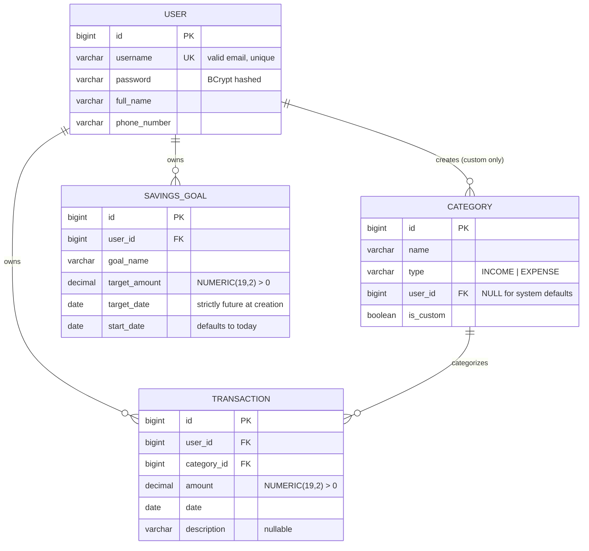

# Implementation Plan — Personal Finance Manager

## Entity Model

### Constraints

| Table | Constraint | Enforcement |
|-------|-----------|-------------|
| `users` | `username` unique | DB unique index |
| `categories` | No custom category may share a name with a default or with another custom of the same user | Service layer (H2 partial-index support is limited) |
| `transactions.amount` | `NUMERIC(19,2)`, scale 2, `HALF_UP` | Application validation |
| `savings_goals.target_amount` | Same | Application validation |

### Indexes (beyond PK / FK auto-indexes)

| Table | Column(s) | Rationale |
|-------|-----------|-----------|
| `transactions` | `(user_id, date DESC, id DESC)` | Covers the default list sort with no extra sort step |
| `categories` | `name` | Fast lookup by name in transaction creation and category deletion |
| `savings_goals` | `user_id` | Fast listing of a user's goals |

---

## Phase 1 — Foundation

Runnable skeleton with infrastructure and error handling; no business logic yet.

| # | What | Commit |
|---|------|--------|
| 1 | Add `springdoc-openapi-starter-webmvc-ui` 2.x and JaCoCo 0.8.x plugin (report only, no minimum gate yet) to `pom.xml` | `chore: add springdoc-openapi and jacoco to pom.xml` |
| 2 | `application.yml` — `dev` profile: H2 in-memory, H2 console, `show-sql=true`; `prod` profile: logging adjusted; shared: `server.port=${PORT:8080}`, `server.forward-headers-strategy=framework`, DDL auto-create | `chore: configure application.yml with dev/prod profiles` |
| 3 | `ClockConfig` bean (`Clock.systemDefaultZone()`); `OpenApiConfig` (title + description) | `feat(config): add Clock bean and OpenApiConfig` |
| 4 | `ErrorResponse` record (timestamp, status, error, message, path, fieldErrors); domain exception hierarchy: `ResourceNotFoundException`, `DuplicateResourceException`, `ForbiddenOperationException`, `BusinessValidationException` | `feat(common): add ErrorResponse and domain exception types` |
| 5 | `GlobalExceptionHandler` (`@RestControllerAdvice`) — handles all cases from CLAUDE.md: Bean Validation, type mismatch, missing param, no-resource-found, method not allowed, domain exceptions, `DataIntegrityViolationException`, generic fallback | `feat(common): add GlobalExceptionHandler for all known error cases` |
| 6 | Unit tests for `GlobalExceptionHandler` verifying each handler returns the correct status + JSON shape | `test(common): add unit tests for GlobalExceptionHandler` |

---

## Phase 2 — Users and Auth

Session-based authentication with all Spring Security 6 gotchas addressed.

| # | What | Commit |
|---|------|--------|
| 1 | `User` JPA entity (id, username, password, fullName, phoneNumber); `UserRepository` (`findByUsername`) | `feat(user): add User entity and repository` |
| 2 | `AppUserDetailsService` implementing `UserDetailsService`; `BCryptPasswordEncoder` bean | `feat(auth): add AppUserDetailsService and password encoder` |
| 3 | `SecurityConfig` — CSRF disabled, `SessionCreationPolicy.IF_REQUIRED`, explicit `HttpSessionSecurityContextRepository` save, custom 401 `AuthenticationEntryPoint`, custom 403 `AccessDeniedHandler`, cookie config (`HttpOnly`, `SameSite=Lax`), permit list | `feat(config): add SecurityConfig with session auth and JSON error handlers` |
| 4 | `AuthService` (register, login, logout); `AuthController` at `/api/auth`; `CurrentUserProvider` | `feat(auth): implement register, login, and logout endpoints` |
| 5 | Unit tests for `AuthService` — register success, duplicate username → 409, login success, bad credentials → 401, logout | `test(auth): add AuthService unit tests` |
| 6 | `@SpringBootTest` + `MockMvc` integration test: register → login → assert `JSESSIONID` cookie → call protected endpoint → logout → call protected endpoint → assert 401 | `test(auth): add session lifecycle integration test` |

---

## Phase 3 — Categories

Default seeding, list, create custom, delete with all guard rules.

| # | What | Commit |
|---|------|--------|
| 1 | `CategoryType` enum; `Category` JPA entity; `CategoryRepository` with `findByName`, `findByNameAndUserIdIsNull`, `findAllByUserIdIsNullOrUserId` | `feat(category): add Category entity, enum, and repository` |
| 2 | `DefaultCategorySeeder` (`ApplicationRunner`) — idempotent: inserts defaults only when not already present | `feat(category): seed default categories on startup` |
| 3 | `CategoryService` (list, create, delete with guards); `CategoryController` at `/api/categories` | `feat(category): add category list, create, and delete endpoints` |
| 4 | Unit tests for `CategoryService` — delete default → 403, delete in-use → 400, delete unknown → 404, duplicate name → 409, create success | `test(category): add CategoryService unit tests` |
| 5 | `@WebMvcTest(CategoryController)` slice tests — status codes and response shape | `test(category): add CategoryController slice tests` |

---

## Phase 4 — Transactions

CRUD with category name resolution, future-date guard, owner scoping, filtered list.

| # | What | Commit |
|---|------|--------|
| 1 | `Transaction` JPA entity; `TransactionRepository` — base query ordered by `date DESC, id DESC`; optional-filter JPQL query (startDate, endDate, categoryId, type) | `feat(transaction): add Transaction entity and repository` |
| 2 | `TransactionService` (create, list, update, delete); `TransactionController` at `/api/transactions` | `feat(transaction): implement transaction CRUD endpoints` |
| 3 | Filter params `startDate`, `endDate`, `categoryId` (Long), `type` as optional `@RequestParam`; implemented via JPA `Specification` or a single JPQL query with nullable predicates | `feat(transaction): add date-range, category, and type filter params` |
| 4 | Unit tests for `TransactionService` — future date → 400, unknown category → 400, other user → 404, filter combinations | `test(transaction): add TransactionService unit tests` |
| 5 | `@WebMvcTest(TransactionController)` slice tests | `test(transaction): add TransactionController slice tests` |

---

## Phase 5 — Savings Goals

CRUD with live progress via aggregate DB query (no in-memory loops).

| # | What | Commit |
|---|------|--------|
| 1 | `SavingsGoal` JPA entity; `GoalRepository` — `findByIdAndUserId`, JPQL `SUM(t.amount) ... WHERE t.categoryType = :type AND t.date >= :startDate AND t.userId = :userId` for income and expenses | `feat(goal): add SavingsGoal entity and repository with progress query` |
| 2 | `GoalService` (create, list, get, update, delete; progress calculation with `BigDecimal` rounding); `GoalController` at `/api/goals` | `feat(goal): implement savings goal CRUD with progress tracking` |
| 3 | Unit tests for `GoalService` — progress math (negative, over 100%), targetDate in past → 400, other user → 403, not found → 404 | `test(goal): add GoalService unit tests` |
| 4 | `@WebMvcTest(GoalController)` slice tests | `test(goal): add GoalController slice tests` |

---

## Phase 6 — Reports

Monthly and yearly summaries via `GROUP BY` queries; never aggregated in Java.

| # | What | Commit |
|---|------|--------|
| 1 | `ReportService` — two JPQL queries grouping by category name and type; `ReportController` at `/api/reports`; month (1–12) and year (1900–2100) validation → 400 | `feat(report): implement monthly and yearly report endpoints` |
| 2 | Unit tests for `ReportService` — empty period returns empty maps and `0.00`, correct aggregation | `test(report): add ReportService unit tests` |
| 3 | `@WebMvcTest(ReportController)` — invalid month → 400, invalid year → 400 | `test(report): add ReportController slice tests` |

---

## Phase 7 — Hardening

| # | What | Commit |
|---|------|--------|
| 1 | Add JaCoCo `<rule>` enforcing ≥80% line coverage to the `verify` lifecycle; run `./mvnw verify` and fill real coverage gaps — no tests that exist only to bump numbers | `chore(jacoco): enforce 80% line coverage on verify` |
| 2 | JavaDoc pass: every public class and public method in controllers and services | `docs: add JavaDoc to all public controller and service methods` |
| 3 | Full codebase read-through: fix naming inconsistencies, remove unused imports, replace magic numbers with named constants | `refactor: naming and dead-code consistency pass` |

---

## Phase 8 — Local Grading

1. `./mvnw spring-boot:run`
2. `bash .assignment/financial_manager_tests.sh http://localhost:8080/api`
3. For each failure: isolate root cause → fix → `fix(<feature>): <description>` commit → re-run.
4. Repeat until 86/86.

> **Prerequisite:** `.assignment/financial_manager_tests.sh` is not yet present in the repo. It must be provided before this phase can begin.

---

## Phase 9 — Deployment and Docs

| # | What | Commit |
|---|------|--------|
| 1 | Multi-stage `Dockerfile` (Maven build stage → `eclipse-temurin:17-jre`, non-root user, `JAVA_OPTS` for 512 MB) + `.dockerignore` | `feat(deploy): add multi-stage Dockerfile` |
| 2 | `render.yaml` for one-click Render deployment | `chore: add render.yaml` |
| 3 | `README.md` with all required sections (live URL, Swagger link, stack, local run, tests, API table, error format, design decisions, project structure, assumptions) | `docs: add comprehensive README` |
